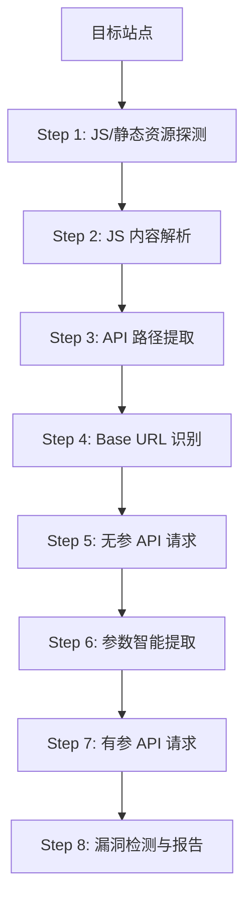

# 实战测试技术方案

需求名称：combat-testing
更新日期：2026-03-22

## 1. 概述

### 1.1 背景与目的

本方案旨在对 ChkApi（API 安全检测自动化工具）进行全方位实战能力检验。通过对 4 个不同类型的外部目标网站进行真实扫描测试，**重点验证 API 发现能力和敏感信息检测能力**，附带验证漏洞检测能力。

### 1.2 测试重点

| 优先级 | 测试重点 | 说明 |
|-------|---------|------|
| **P0** | API 发现能力 | JS 提取、API 路径识别、Base URL 发现、Swagger 解析 |
| **P0** | 敏感信息检测 | JWT/Token、云平台 AK/SK、密码、凭证、配置泄漏 |
| P1 | 漏洞检测 | 未授权访问、文件操作等安全风险（附带验证） |

| 目标网站 | 类型 | 协议 | 说明 |
|---------|------|------|------|
| zhyll.ijiangyin.com:7080 | HTTP | 非标准端口 | 政企系统 |
| hgoa.jyeport.com | HTTP | 标准端口 | 办公自动化系统 |
| https://bus.jycrtc.com/ | HTTPS | 标准端口 | 公交/客运系统 |
| http://a.chengxinjiance.com/ | HTTP | 标准端口 | 检测认证系统 |

## 2. 测试策略

### 2.1 测试配置

| 配置项 | 设置值 |
|-------|-------|
| 扫描模式 | `--at 0` (收集+探测) |
| Cookie | 不需要 |
| 代理 | 不需要 |
| Chrome 渲染 | 默认开启 |

### 2.2 测试维度

| 测试维度 | 检测内容 |
|---------|---------|
| JS 提取能力 | 自动加载 JS、CDN JS、其他域 JS、动态加载 JS |
| API 发现能力 | Webpack 打包识别、Swagger 解析、正则匹配、Fuzz |
| Base URL 识别 | 微服务识别、路径分析 |
| 参数提取 | 响应式参数提取、错误信息参数提取 |
| 漏洞检测 | 未授权访问、敏感信息泄漏、SQL 注入、XSS |
| Bypass 能力 | 多种 Bypass 技术绕过限制 |

### 2.3 测试命令

```bash
# 目标 1: zhyll.ijiangyin.com:7080
python3 ChkApi.py -u http://zhyll.ijiangyin.com:7080

# 目标 2: hgoa.jyeport.com
python3 ChkApi.py -u http://hgoa.jyeport.com

# 目标 3: bus.jycrtc.com (HTTPS)
python3 ChkApi.py -u https://bus.jycrtc.com/

# 目标 4: a.chengxinjiance.com
python3 ChkApi.py -u http://a.chengxinjiance.com/
```

## 3. 架构设计

### 3.1 测试流程



### 3.2 结果输出结构

```
results/
├── zhyll_ijiangyin_com_7080/
│   ├── results.db          # SQLite 数据库
│   ├── *.xlsx              # Excel 报告
│   └── responses/          # 响应包存储
├── hgoa_jyeport_com/
├── bus_jycrtc_com/
└── a_chengxinjiance_com/
```

## 4. 测试用例设计

### 4.1 API 发现能力测试用例（重点）

| 用例编号 | 测试场景 | 预期结果 | 优先级 |
|---------|---------|---------|-------|
| API-01 | 探测目标站点存活状态 | 正确识别站点可访问性 | P0 |
| API-02 | 提取自动加载的 JS | 获取所有 script src 链接 | P0 |
| API-03 | 解析 Webpack 打包 JS | 提取 chunk js 路径 | P0 |
| API-04 | 从 JS 中提取 API 路径 | 识别 /api/* 等模式 | P0 |
| API-05 | 识别 Base URL | 发现微服务前缀 | P0 |
| API-06 | Swagger 各版本解析 | 提取接口文档 | P0 |
| API-07 | 无参请求所有 API | 获取响应内容 | P1 |
| API-08 | 智能提取参数 | 从响应中提取 key、param | P1 |
| API-09 | 有参请求验证 | 携带参数测试 | P1 |
| API-10 | Fuzz 测试补全接口 | 补充字典未覆盖的接口 | P1 |

### 4.2 敏感信息检测测试用例（重点）

| 用例编号 | 测试场景 | 预期结果 | 优先级 |
|---------|---------|---------|-------|
| S-01 | JWT/Token 检测 | 识别响应中的 eyJ* Token | P0 |
| S-02 | 云平台 AK/SK 检测 | 识别阿里云、AWS、腾讯云等密钥 | P0 |
| S-03 | 密码/凭证泄漏 | 识别配置文件中的密码明文 | P0 |
| S-04 | 内部 IP/域名泄漏 | 识别内网地址暴露 | P0 |
| S-05 | 私钥/证书检测 | 识别 RSA/SSH 私钥 | P0 |
| S-06 | Git Token 检测 | 识别 GitLab/GitHub Token | P0 |
| S-07 | Webhook URL 检测 | 识别钉钉/飞书机器人 | P1 |
| S-08 | 数据库连接泄漏 | 识别 JDBC 连接字符串 | P1 |

### 4.3 漏洞检测测试用例（附带）

| 用例编号 | 测试场景 | 预期结果 | 优先级 |
|---------|---------|---------|-------|
| V-01 | 未授权访问检测 | 检测无需认证的敏感接口 | P1 |
| V-02 | Bypass 绕过测试 | 绕过 401/404/403 限制 | P2 |
| V-03 | 文件操作接口检测 | 检测 upload/download/read 接口 | P2 |

## 5. 评估指标

### 5.1 API 发现能力指标（重点）

| 指标 | 说明 | 目标值 |
|-----|------|-------|
| API 总数 | 提取到的 API 路径总数 | 越多越好 |
| Base URL 识别数 | 识别出的微服务前缀数量 | 反映微服务架构识别能力 |
| Swagger 解析率 | 成功解析的 Swagger 文档比例 | 反映接口文档解析能力 |
| JS 提取率 | 成功获取的 JS / 总探测 JS | >80% |

### 5.2 敏感信息检测指标（重点）

| 指标 | 说明 | 目标值 |
|-----|------|-------|
| 敏感信息类型覆盖率 | 检测到的类型 / 配置规则总数 | 反映规则完整性 |
| JWT/Token 检测数 | 发现的有效 Token 数量 | 反映凭证识别能力 |
| 云平台密钥检测数 | 发现的 AK/SK 数量 | 反映密钥规则覆盖面 |
| 误报率 | 误报数量 / 总报告数 | <20% |

### 5.3 漏洞检测指标（附带）

| 指标 | 说明 | 目标值 |
|-----|------|-------|
| 高危漏洞数 | 未授权访问、命令执行等 | 反映核心漏洞发现能力 |
| Bypass 成功率 | 绕过成功的次数 / 尝试次数 | 反映绕过技术有效性 |

## 6. 风险与注意事项

### 6.1 风险控制

1. **网络风险**: 目标站点可能不可达，需提前验证
2. **探测风险**: 大量请求可能触发目标站点防护
3. **数据风险**: 扫描结果包含敏感信息需妥善保管

### 6.2 免责声明

测试仅用于安全检测学习交流目的，不得用于非法用途。

## 7. 实施计划

| 阶段 | 内容 | 产出 |
|-----|------|------|
| P1 | 目标站点存活验证 | 站点可访问性报告 |
| P2 | 完整扫描执行 | 各目标扫描结果 |
| P3 | 结果汇总分析 | 能力评估报告 |
| P4 | 问题复盘优化 | 优化建议文档 |

## 8. 引用链接

- ChkApi 项目地址: https://github.com/0x727/ChkApi_0x727
